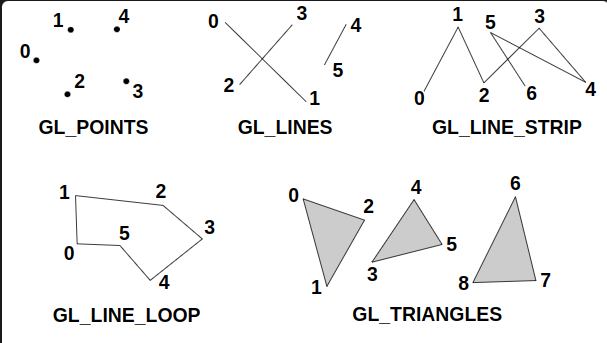

# Computação Gráfica - UFABC

## Atividade 1

- Nome dos integrantes: Fernando Schroder / Gabriel Yuto Munakata
- RAs: 11201921885/ 11201721879
- Link WebAssembly: https://gabrielyuto.github.io/computacao-grafica-atv-1/atividade-1/index.html

## Descrição da aplicação:

Utilizando como base a aplicação relacionada a geração de triângulos coloridos, o objetivo deste projeto é explorar as funcionalidades dos widgets presentes na biblioteca Dear ImGui e nos modos das primitivas suportadas pelo OpenGL.
Dessa forma, por meio de um ComboBox, criamos um seletor de primitivas que permite alterar de modo dinâmico o parâmetro que é passado ao GLDraw. Dentre as geometrias exploradas, incluimos no comboBox as seguintes definições:

- GL_POINTS: cada vértice forma um ponto que será desenhado na tela como um pixel ou como um quadrilátero centralizado no vértice. O tamanho do ponto/quadrilátero pode ser definido pelo usuário17;
- GL_LINES: cada grupo de dois vértices forma um segmento de reta;
- GL_LINE_STRIP: os vértices são conectados em ordem para formar uma polilinha;
- GL_LINE_LOOP: os vértices são conectados em ordem para formar uma polilinha, e o último vértice forma um segmento com o primeiro vértice, formando um laço;

(notas de aulas)

## Implementação

Para a implementação, definimos três variáveis dentro de window.hpp. Estas variáveis são dinâmicas e são utilizadas como parâmetros para alterar o modo da primitiva (GLenum type_mode{GL_TRIANGLES}), fornecer a quantidade para o GLDrawsArray (int glDraw_count{3}) e por fim o parametro de delay (float delay{1});

Além disso, no arquivo window.cpp, incluimos essas variáveis no método OnPaint(), sendo o delay implementado no timer da linha 40, e os valores de Type_mode e count do GLDrawArrays na linha 51.
Em relação aos widgets, no método OnPaintUI(), incluimos primeiramente um botão de clear (linha 69), e dois botões do tipo slider, sendo que para o parâmetro de contagem utilizamos um SliderInt (linha 128) e para o delay um SliderFloat (linha 132).
Por fim, para o seletor de primitivas, utilizamos um comboBox, que dentro dele é criado uma lógica com Switch para alternar entre os valores que são selecionados na interface do usuário.
